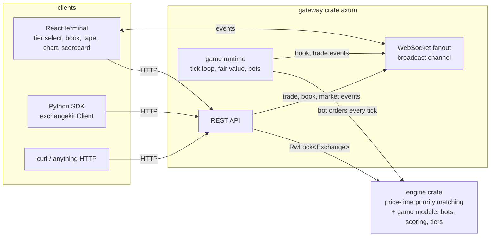

# exchangekit

A trading game built on a real matching engine. You get a timed round on a
live limit order book, a hidden fair value you have to infer, and a pit full
of algorithmic bots to trade against. At the buzzer you get a scorecard:
PnL, return, Sharpe, and max drawdown, computed the way a desk would.

[](https://github.com/andreruizloera/exchangekit/actions/workflows/ci.yml)
[](LICENSE)
[](sdk/python)

Underneath is a Rust matching engine with strict price-time priority, a REST
plus WebSocket gateway, and a dark trading terminal in React. The bots run
server-side and place and cancel real orders through the same engine you do.

**Play money only.** exchangekit is a simulator for education and research.
It has no real-money custody, no payments, no brokerage, and no
authentication. Nothing here is trading advice. Do not put real value behind
it.


## The game

One round trades a single synthetic asset. Its true value is hidden and moves
as a random walk with drift and the occasional news jump. You never see it
directly; you infer it from the book and the tape. You start with play-money
cash and a block of inventory, quote and take through the ordinary order
ticket, and try to finish ahead. The clock runs 2 to 5 minutes.


The terminal is live: an order book with depth bars, a price chart with your
own fills marked, a trade tape, and a PnL and equity readout that update on
every tick over the WebSocket feed. When the clock hits zero you get a
scorecard and a one-line grade.


### The bots

Every bot has a real strategy and reasons about a private, noisy estimate of
the hidden fair value. They are named on the opponents panel during a round.

- **Drift** (noise trader): posts single orders on a random side at a random
  offset from a value that wanders far from the truth. This is the pickable
  liquidity everyone else feeds on.
- **Quotefill** (market maker): quotes both sides around its fair estimate to
  earn the spread. It widens when the tape is volatile and skews its quotes
  against its inventory to stay flat. On the hard tier it backs off when flow
  looks toxic, so it is not the one being picked off.
- **Chaser** (momentum): reads a short-term trend off the tape and takes
  liquidity in that direction, pushing price the way it is already moving.
- **Fade** (mean reversion): sells rallies and buys dips against its own
  moving average, supplying the counter-flow that anchors a quiet market.
- **Sniper** (informed, hard only): knows the fair value almost exactly and
  sweeps any resting order priced on the wrong side of it. This is the
  adverse selection that punishes a stale quote, yours included.

### The tiers

The tiers differ in ways that change how hard it is to make money, not just
in cosmetic numbers.

| Tier | Clock | Maker spread | Who is in the pit | Feel |
| --- | --- | --- | --- | --- |
| Easy | 1.1s | ~8c | 3 Drift, 1 Quotefill | Wide spreads and slow flow. Basic two-sided quoting captures the spread. |
| Medium | 0.7s | ~4c | 2 Drift, 1 Quotefill, 1 Chaser, 1 Fade | Tighter quotes and real trend pressure. You need an actual edge. |
| Hard | 0.4s | ~2c | 1 Drift, 2 Quotefill, 1 Chaser, 1 Sniper | Tight books that pull on toxic flow, plus a sniper that knows fair value. Lazy quoting gets adversely selected. |

### The scorecard

Everything is computed from your mark-to-market equity curve, sampled once per
tick, plus your trade count. Nothing is a made-up score.

- **PnL and return**: final equity minus starting equity, and that as a
  percent of where you started. Equity marks your inventory at the book
  midpoint, so holding a position while the fair value moves is real risk.
- **Sharpe**: the mean per-tick return over its standard deviation, scaled by
  the square root of the number of ticks so it reads on the usual Sharpe
  scale. A flat curve scores zero.
- **Max drawdown**: the worst peak-to-trough decline of the equity curve.
- **Grade**: a blunt one-liner from your return and Sharpe.

Your best runs per tier are kept in the browser via `localStorage` and shown
on the tier cards.

## Quickstart

```
git clone https://github.com/andreruizloera/exchangekit
cd exchangekit
docker compose up
```

Open http://localhost:3000, pick a tier, and play. The gateway API is on
http://localhost:8080.

Native, for faster iteration:

```
cargo run -p exchangekit-gateway          # gateway + engine on :8080
cd frontend && npm install && npm run dev # UI on :3000, proxies to :8080
```

Requirements: Docker (easiest), or a recent stable Rust toolchain (tested
with 1.97), Node 20+, and Python 3.12+ to run the pieces natively.

## Driving a round from code

The gateway exposes the game over plain HTTP, so you can start a round and
trade a bot against the pit without the UI:

```
# start a 3-minute hard round
curl -X POST localhost:8080/api/game/start -H 'content-type: application/json' \
  -d '{"tier":"hard","duration_secs":180}'

# read where it stands (clock, equity, PnL, opponents)
curl localhost:8080/api/game

# trade the round's market as the "player" account
curl -X POST localhost:8080/api/orders -H 'content-type: application/json' \
  -d '{"account":"player","market":"game-1","outcome":"YES","side":"BUY","price":50,"quantity":20}'

# the scorecard, once the clock runs out
curl localhost:8080/api/game/scorecard
```

| Method | Path | Purpose |
| --- | --- | --- |
| POST | /api/game/start | start a round: `{tier, duration_secs?, seed?}` |
| GET | /api/game | live round state: clock, equity, PnL, opponents |
| GET | /api/game/scorecard | the scorecard once the round has ended |

## The exchange underneath

The bots and your orders all go through one matching engine. The core
exchange is also usable on its own, with three seeded prediction markets, a
seeded market maker, and the full order lifecycle. That is what the Python
SDK and `./demo.sh` talk to.

```python
from exchangekit import Client   # pip install ./sdk/python

client = Client("http://localhost:8080")
market = client.market("btc-100k")
client.buy(market=market.id, outcome="YES", price=0.62, quantity=10)
```

Prices are integer cents from 1 to 99. A binary contract settles at 0 or 100
cents, so buying YES at 63c risks $0.63 to win $1.00 per share. Orders are
limit orders; a marketable limit order fills immediately against resting
prices and any remainder rests in the book. Sells require shares; buys escrow
cash at the limit price.

Core REST API (the seeded exchange):

| Method | Path | Purpose |
| --- | --- | --- |
| GET | /api/markets | list seeded markets with price estimates and volume |
| GET | /api/markets/{id}/book?outcome=YES&depth=20 | aggregated bids and asks |
| GET | /api/markets/{id}/trades?limit=50 | recent trades, newest first |
| POST | /api/orders | place a limit order |
| DELETE | /api/orders/{id}?account=demo | cancel an open order |
| GET | /api/accounts/{id} | play-money balance |
| WS | /ws | hello snapshot, then trade, book, and market events |

The Python SDK wraps the exchange with typed methods: `markets`, `market`,
`book`, `trades`, `buy`, `sell`, `place_order`, `cancel`, `order`,
`open_orders`, `positions`, `balance`. See [sdk/python](sdk/python). The
per-round game markets are hidden from `GET /api/markets`, so the SDK and the
demo only ever see the seeded exchange.

## Architecture



The engine is a synchronous, deterministic library with no I/O. Its `game`
module adds the pieces the round needs, all pure and seedable: a fair-value
process, the bot strategies, the difficulty tiers, and the scoring math. The
gateway wraps the engine in an `RwLock` and runs a background tick task: each
tick it advances the fair value, has every bot cancel and requote through the
real `place_order` path, samples your equity, and publishes the fresh book
over the broadcast channel. Because the game logic is pure, a round is
reproducible from a seed and every decision is unit-tested.

## Testing

```
cargo test                        # engine + game + gateway
cd frontend && npm test           # scoring and formatting unit tests
cd sdk/python && .venv/bin/pytest # SDK unit tests; integration tests
                                  # run when a gateway is up, skip otherwise
```

Engine tests cover the matcher (price and time priority, partial and full
fills, marketable limits, cancels and escrow, conservation, snapshots) and
the game logic: the seeded PRNG, the fair-value process staying in bounds,
each bot strategy's core decision from a fixed seed, the Sharpe and drawdown
math against known equity curves, and tier composition. Frontend tests cover
the scorecard grade thresholds and the number formatting.

## Limitations

- No shorting: selling requires owning shares, so both you and the bots start
  each round with an inventory to work down. Managing that inventory is part
  of the game.
- YES and NO books are independent; the game trades a single side.
- State is in memory. The core exchange can restore from a JSON snapshot
  (`EXCHANGEKIT_SNAPSHOT`), but game rounds are ephemeral by design.
- No authentication: any client can act as any account. This is a local
  simulator, not a service.

See [ROADMAP.md](ROADMAP.md) for planned work.

## Contributing

See [CONTRIBUTING.md](CONTRIBUTING.md). The short version: keep the engine
deterministic, add a test for every matching or strategy behavior change, and
nothing that touches real money will be merged.

## License

MIT. See [LICENSE](LICENSE).

GitHub topics: trading-game, market-microstructure, algorithmic-trading,
matching-engine, orderbook, prediction-markets.
