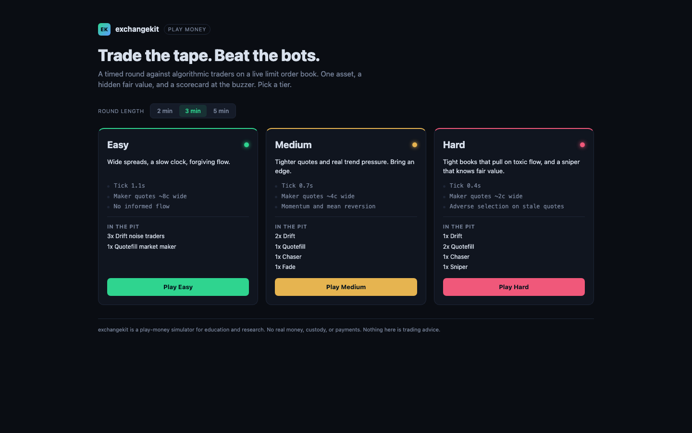
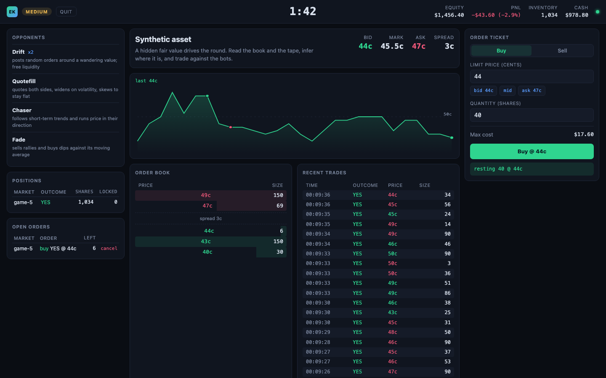
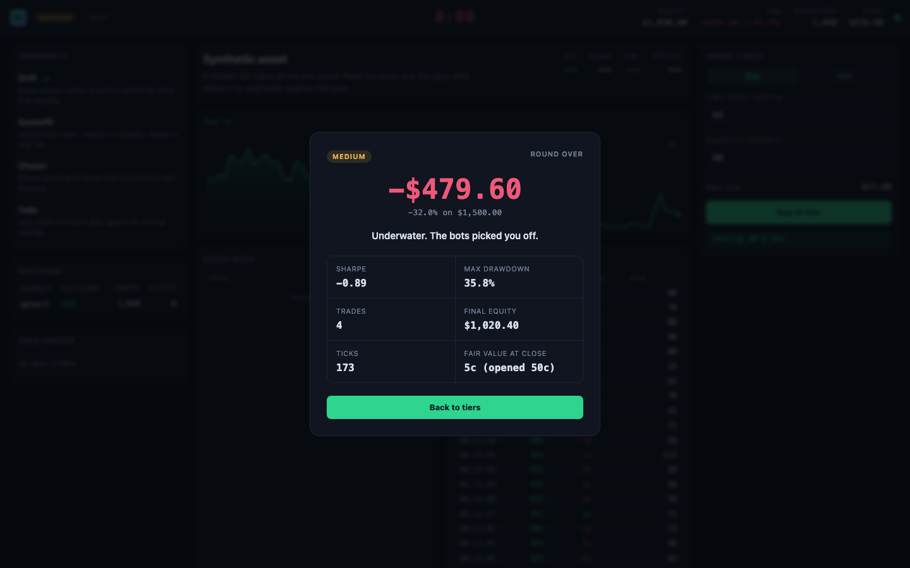
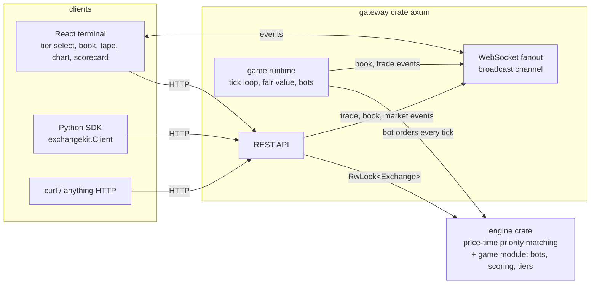

# exchangekit

A trading game built on a real matching engine. You get a timed round on a
live limit order book, a hidden fair value you have to infer, and a pit full
of algorithmic bots to trade against. At the buzzer you get a scorecard:
PnL, return, Sharpe, and max drawdown, computed the way a desk would.

[](https://github.com/andreruizloera/exchangekit/actions/workflows/ci.yml)
[](LICENSE)
[](sdk/python)

Underneath is a Rust matching engine with strict price-time priority, a REST
plus WebSocket gateway, and a dark trading terminal in React. The bots run
server-side and place and cancel real orders through the same engine you do.

**Play money only.** exchangekit is a simulator for education and research.
It has no real-money custody, no payments, no brokerage, and no
authentication. Nothing here is trading advice. Do not put real value behind
it.



## The game

One round trades a single synthetic asset. Its true value is hidden and moves
as a random walk with drift and the occasional news jump. You never see it
directly; you infer it from the book and the tape. You start with play-money
cash and a block of inventory, quote and take through the ordinary order
ticket, and try to finish ahead. The clock runs 2 to 5 minutes.



The terminal is live: an order book with depth bars, a price chart with your
own fills marked, a trade tape, and a PnL and equity readout that update on
every tick over the WebSocket feed. When the clock hits zero you get a
scorecard and a one-line grade.



### The bots

Every bot has a real strategy and reasons about a private, noisy estimate of
the hidden fair value. They are named on the opponents panel during a round.

- **Drift** (noise trader): posts single orders on a random side at a random
  offset from a value that wanders far from the truth. This is the pickable
  liquidity everyone else feeds on.
- **Quotefill** (market maker): quotes both sides around its fair estimate to
  earn the spread. It widens when the tape is volatile and skews its quotes
  against its inventory to stay flat. On the hard tier it backs off when flow
  looks toxic, so it is not the one being picked off.
- **Chaser** (momentum): reads a short-term trend off the tape and takes
  liquidity in that direction, pushing price the way it is already moving.
- **Fade** (mean reversion): sells rallies and buys dips against its own
  moving average, supplying the counter-flow that anchors a quiet market.
- **Sniper** (informed, hard only): knows the fair value almost exactly and
  sweeps any resting order priced on the wrong side of it. This is the
  adverse selection that punishes a stale quote, yours included.

### The tiers

The tiers differ in ways that change how hard it is to make money, not just
in cosmetic numbers.

| Tier | Clock | Maker spread | Who is in the pit | Feel |
| --- | --- | --- | --- | --- |
| Easy | 1.1s | ~8c | 3 Drift, 1 Quotefill | Wide spreads and slow flow. Basic two-sided quoting captures the spread. |
| Medium | 0.7s | ~4c | 2 Drift, 1 Quotefill, 1 Chaser, 1 Fade | Tighter quotes and real trend pressure. You need an actual edge. |
| Hard | 0.4s | ~2c | 1 Drift, 2 Quotefill, 1 Chaser, 1 Sniper | Tight books that pull on toxic flow, plus a sniper that knows fair value. Lazy quoting gets adversely selected. |

### The scorecard

Everything is computed from your mark-to-market equity curve, sampled once per
tick, plus your trade count. Nothing is a made-up score.

- **PnL and return**: final equity minus starting equity, and that as a
  percent of where you started. Equity marks your inventory at the book
  midpoint, so holding a position while the fair value moves is real risk.
- **Sharpe**: the mean per-tick return over its standard deviation, scaled by
  the square root of the number of ticks so it reads on the usual Sharpe
  scale. A flat curve scores zero.
- **Max drawdown**: the worst peak-to-trough decline of the equity curve.
- **Grade**: a blunt one-liner from your return and Sharpe.

Your best runs per tier are kept in the browser via `localStorage` and shown
on the tier cards.

## Quickstart

```
git clone https://github.com/andreruizloera/exchangekit
cd exchangekit
docker compose up
```

Open http://localhost:3000, pick a tier, and play. The gateway API is on
http://localhost:8080.

Native, for faster iteration:

```
cargo run -p exchangekit-gateway          # gateway + engine on :8080
cd frontend && npm install && npm run dev # UI on :3000, proxies to :8080
```

Requirements: Docker (easiest), or a recent stable Rust toolchain (tested
with 1.97), Node 20+, and Python 3.12+ to run the pieces natively.

## Driving a round from code

The gateway exposes the game over plain HTTP, so you can start a round and
trade a bot against the pit without the UI:

```
# start a 3-minute hard round
curl -X POST localhost:8080/api/game/start -H 'content-type: application/json' \
  -d '{"tier":"hard","duration_secs":180}'

# read where it stands (clock, equity, PnL, opponents)
curl localhost:8080/api/game

# trade the round's market as the "player" account
curl -X POST localhost:8080/api/orders -H 'content-type: application/json' \
  -d '{"account":"player","market":"game-1","outcome":"YES","side":"BUY","price":50,"quantity":20}'

# the scorecard, once the clock runs out
curl localhost:8080/api/game/scorecard
```

| Method | Path | Purpose |
| --- | --- | --- |
| POST | /api/game/start | start a round: `{tier, duration_secs?, seed?}` |
| GET | /api/game | live round state: clock, equity, PnL, opponents |
| GET | /api/game/scorecard | the scorecard once the round has ended |

## The exchange underneath

The bots and your orders all go through one matching engine. The core
exchange is also usable on its own, with three seeded prediction markets, a
seeded market maker, and the full order lifecycle. That is what the Python
SDK and `./demo.sh` talk to.

`./demo.sh` against a fresh gateway, the first four parts:

```
== markets ==
btc-100k      YES 63c  NO 37c  vol  105  Will Bitcoin close above $100,000 this year?
fed-cut-dec   YES 44c  NO 56c  vol  157  Will the Fed cut rates at its December meeting?
mars-2030     YES  8c  NO 92c  vol  209  Will humans land on Mars before 2030?

== order book: btc-100k YES (top 3) ==
  ask 66c  x 90
  ask 65c  x 260
  ask 64c  x 180
  ----
  bid 62c  x 180
  bid 61c  x 260
  bid 60c  x 120

== demo buys 10 YES at the best ask ==
  order 79: filled, filled 10/10
  trade: 10 YES @ 64c (demo bought from marketmaker)

== demo account after the trade ==
  balance $10,451.30 (available $10,451.30)
  position: 540 YES shares in btc-100k
```

The same thing through the SDK:

```python
from exchangekit import Client   # pip install ./sdk/python

client = Client("http://localhost:8080")
market = client.market("btc-100k")
client.buy(market=market.id, outcome="YES", price=0.62, quantity=10)
```

Prices are integer cents from 1 to 99. A binary contract settles at 0 or 100
cents, so buying YES at 63c risks $0.63 to win $1.00 per share. Orders are
limit orders; a marketable limit order fills immediately against resting
prices and any remainder rests in the book, unless its `time_in_force` says
otherwise. Sells require shares; buys escrow cash at the limit price.

Core REST API (the seeded exchange):

| Method | Path | Purpose |
| --- | --- | --- |
| GET | /api/markets | list seeded markets with price estimates and volume |
| GET | /api/markets/{id}/book?outcome=YES&depth=20 | aggregated bids and asks |
| GET | /api/markets/{id}/trades?limit=50 | recent trades, newest first |
| POST | /api/orders | place a limit order, optionally with `time_in_force` |
| DELETE | /api/orders/{id}?account=demo | cancel an open order |
| GET | /api/accounts/{id} | play-money balance |
| POST | /api/markets/{id}/mint | buy YES/NO pairs at 100c each: `{account, quantity}` |
| POST | /api/markets/{id}/redeem | sell YES/NO pairs back for 100c each |
| POST | /api/markets/{id}/resolve | settle the market: `{outcome}` |
| GET | /api/markets/{id}/settlement | the settlement report of a resolved market |
| WS | /ws | hello snapshot, then trade, book, market, and resolution events |

The Python SDK wraps the exchange with typed methods: `markets`, `market`,
`book`, `trades`, `buy`, `sell`, `place_order`, `cancel`, `order`,
`open_orders`, `positions`, `balance`, `mint`, `redeem`, `resolve`,
`settlement`. See [sdk/python](sdk/python). The per-round game markets are
hidden from `GET /api/markets`, so the SDK and the demo only ever see the
seeded exchange.

## Complementary matching: one market, two books

A YES share and a NO share of the same market settle for 100 cents between
them, whichever way it goes. So bidding 63 for YES and bidding 37 for NO
are the same trade seen from two sides, and the two books of a market are
one book seen from two directions. A taker takes the best price it can find
in either of them.

Crossing the complementary book does not move shares between two accounts,
because the two sides want opposite outcomes. It creates or destroys them:

- **Two buyers cross and the pair is minted.** They pay 63 and 37, which is
  exactly the 100 cents of collateral one pair needs, so the mint funds
  itself out of what the two of them paid. Neither had to already hold a
  share.
- **Two sellers cross and the pair is burned.** The 100 cents behind it is
  released and split between them at their prices. Both have to actually
  hold the share they are selling, and both had it locked against the sell,
  so the escrow is released in the same step the share is destroyed.

Parts 5 to 7 of `./demo.sh`, on a fresh gateway:

```
== two bids on opposite outcomes mint a pair ==
  collateral before:      $101,500.00
  alice bids 63c for 20 YES
  order 80: open, filled 0/20
  bob bids 37c for 20 NO   (63 + 37 = 100, so the pair pays for itself)
  order 81: filled, filled 20/20
    trade 14: 20 NO @ 37c  mint
  collateral after:       $101,520.00

== two asks on opposite outcomes burn one back ==
  alice offers 20 NO at 37c
  order 82: open, filled 0/20
  bob offers 20 YES at 63c (100 - 37, so the pair is worth exactly what they ask)
  order 83: filled, filled 20/20
    trade 15: 20 YES @ 63c  burn
  collateral after:       $101,500.00

== demo redeems 100 pairs for cash ==
  demo now holds:         440 YES, 400 NO
  demo balance:           $10,551.30
  collateral after:       $101,400.00
  cash plus collateral:   $1,036,000.00 before, $1,036,000.00 after
```

Six things there are decisions worth naming.

**Priority runs across both books, not within one.** Every fill takes the
best price available anywhere in the market: the cheapest offer of the
outcome, whether that is a resting ask on its own book or a resting bid on
the other. Equal prices go to the older resting order, so a NO bid placed
before a YES ask at the same effective price fills first. That is ordinary
price-time priority; the only new part is that "the book" is both of them.

**The mint is self-funding, so no unbacked cash is created.** The taker
pays its execution price and the maker pays the maker's, and those two
always sum to 100. The cents that leave the two accounts are exactly the
cents the collateral pool takes in. Cash plus collateral is unchanged by a
mint, by a burn, and by a redemption, which is what the last line of the
demo checks on every run.

**Nothing rounds.** Prices are whole cents from 1 to 99 and a pair is 100 of
them, so both halves of a complementary cross are exact at every price. A
cross at 1 and 99 splits as cleanly as one at 50 and 50. There is no lot
size either: one share is one pair.

**A burn cannot release cents the market does not hold.** Burning draws on
the market's collateral pool. The engine caps a burn at the number of pairs
the pool covers and takes the complementary sell side off the table
entirely when the pool is empty, so the pool never goes negative and a
seller's order simply rests instead. That matters because `grant_shares`
creates shares with no collateral behind them; a market full of granted
shares can be sold into its own book but not burned out of it.

**A trade record gained a field rather than a new shape.** A minted pair has
two buyers and no seller, which the existing trade record cannot express
literally. It can express it economically, because buying NO at 37 *is*
selling YES at 63, so the record names a buyer, a seller, one outcome, and
one price exactly as it always did. What it could not say is where the
shares came from, so `Trade` now carries a `kind` of `match`, `mint`, or
`burn`. On a mint, the account named as the seller bought the complementary
outcome and never held this one; on a burn, the account named as the buyer
sold the complementary outcome and never received it. That is the honest
version: a synthetic house counterparty would have been a lie about who was
on the other side, and a separate event type would have split the tape in
two for what is one trade.

**Redeeming is the same primitive without a counterparty.** Holding both
sides of a binary question is holding a dollar, so
`POST /api/markets/{id}/redeem` hands the dollar over on demand, out of the
same pool. `POST /api/markets/{id}/mint` is the inverse and is what the
seed uses to create every share it hands out. Shares committed to a resting
sell do not count toward a redemption: cancel the order first.

```python
client.buy(market="fed-cut-dec", outcome="YES", price=0.44, quantity=5)
trade = other.buy(market="fed-cut-dec", outcome="NO", price=0.56, quantity=5).trades[0]
trade.kind, trade.price          # ('mint', 56)

client.mint("fed-cut-dec", 10)   # 10 pairs for $10.00
client.redeem("fed-cut-dec", 10) # and back again
```

## Order types

An order can say more than its price. `time_in_force` on `POST /api/orders`
takes `gtc` (the default), `ioc`, `fok`, or `post_only`, and all three of
the non-default policies are decided against both books.

| Policy | What it does |
| --- | --- |
| `gtc` | Fill what crosses, rest the remainder. The ordinary limit order. |
| `ioc` | Fill what crosses right now, cancel the rest. Never rests, so it never gives anyone else the option of trading against it later. |
| `fok` | Fill the whole quantity right now or do nothing at all. |
| `post_only` | Never take. Rest, or be refused if any part of it would have crossed. |

The last part of `./demo.sh`, before it settles a market:

```
== order types ==
  ioc bid at 1c:           cancelled filled 0/5
  fok for 1,000,000:       rejected  filled 0/1000000
  post-only at the ask:    rejected  filled 0/5
  post-only at 1c:         open      filled 0/5
  resting afterwards:      1 order(s) at 1c
```

**A refused order is `rejected`, not `cancelled`.** The engine already keeps
`cancelled` (its owner chose to) apart from `voided` (the market resolved
underneath it). A fill-or-kill that could not fill and a post-only that
would have taken are a third thing: their own terms refused them before
they traded or rested. They come back with status `rejected` and no trades
rather than as an error, because nothing about the request was malformed.
They take no escrow and leave both books exactly as they were.

**Both books count.** Whether a post-only order would take, and whether a
fill-or-kill can fill, are questions about the whole market and not one
side of it. A YES bid at 63 crosses a resting NO bid at 38, so post-only
refuses it even with the YES ask sitting at 90. A fill-or-kill counts
complementary depth toward the quantity it needs, and caps that part at the
pairs the collateral pool could afford to burn, because a burn it cannot
fund is depth it cannot reach.

```python
client.buy(market="btc-100k", outcome="YES", price=0.62, quantity=10, time_in_force="ioc")
result = client.buy(market="btc-100k", outcome="YES", price=0.62, quantity=10, time_in_force="fok")
result.order.is_rejected   # True if the books could not cover all ten
```

## Settling a market

That "settles at 0 or 100 cents" is the whole point of a binary contract, so
the exchange can do it. Resolving a market pays 100 cents for every share of
the winning outcome, pays nothing for the other side, voids every resting
order, and closes the market for good. This is the last part of
`./demo.sh`, run against a fresh gateway:

```
== mars-2030 before resolution ==
  status:     open
  collateral: $101,500.00 backing its outstanding shares
  demo holds: 556 YES, 500 NO

== resolve mars-2030 to NO ==
  winner:        NO
  paid out:      $101,500.00 to 4 account(s)
  shares:        101,500 winning, 101,500 losing
  collateral:    $101,500.00 held by the market
  unbacked cash: $0.00
  voided:        18 resting orders, releasing $1,624.56 and 3,634 shares of escrow
    alice           546 winning x $1.00 = $546.00
    bob             500 winning x $1.00 = $500.00
    demo            500 winning x $1.00 = $500.00
    marketmaker  99,954 winning x $1.00 = $99,954.00

== the market is closed ==
  book: 0 price levels left on either side
  new order:     400 market mars-2030 has resolved and no longer trades
  resolve again: 409 market mars-2030 has already resolved
```

Four things in that output are decisions worth naming.

**Orders are voided before anything is paid.** A resting sell has shares
locked against it and a resting buy has cash locked against it. Clearing
positions first would leave the escrow pointing at a position that no longer
exists, and the account would carry a lock it could never release on a market
that no longer trades. Releasing first means every share the payout sees is
one its owner holds free and clear, including the 3,634 that were sitting in
sell orders.

**A voided order is not a cancelled one.** Its status is `voided`: the market
resolved underneath it, which is not something its owner chose.

**Unbacked cash is reported, not hidden.** Trading conserves cash plus
collateral: an ordinary cross turns a buyer's cents into a seller's, and a
mint or a burn moves cents between accounts and the market's pool. Neither
creates any. Settlement is different: it pays against shares, and a share
only funds itself if it was minted as a YES/NO pair against 100 cents of
collateral. The seeded exchange mints every share that way, which is why
the payout above exactly matches the collateral and `unbacked cash` reads
`$0.00`. The engine also has `grant_shares`, which creates shares for free
(the game hands out one-sided inventory that way), and settling those
creates cash out of nothing. The engine does not forbid it. It refuses to
hide it: the shortfall is computed on every settlement and printed with a
name. Complementary matching does not move that number either way, because
a burn takes one winning share out of circulation for every dollar it takes
out of the pool.

**Resolution happens once.** A second call is a 409, not a second payout.

```python
settlement = client.resolve("mars-2030", "NO")
settlement.total_paid, settlement.unbacked_cash   # (10150000, 0)
client.market("mars-2030").resolved_outcome       # 'NO'
```

There is no authentication anywhere in the gateway, so anyone who can reach
it can settle a market. That is acceptable in a local simulator running on
your own machine and would not be acceptable anywhere else.

## Architecture



The engine is a synchronous, deterministic library with no I/O. Its `game`
module adds the pieces the round needs, all pure and seedable: a fair-value
process, the bot strategies, the difficulty tiers, and the scoring math. The
gateway wraps the engine in an `RwLock` and runs a background tick task: each
tick it advances the fair value, has every bot cancel and requote through the
real `place_order` path, samples your equity, and publishes the fresh book
over the broadcast channel. Because the game logic is pure, a round is
reproducible from a seed and every decision is unit-tested.

## Testing

```
cargo test                        # engine + game + gateway
cd frontend && npm test           # scoring and formatting unit tests
cd sdk/python && .venv/bin/pytest # SDK unit tests; integration tests
                                  # run when a gateway is up, skip otherwise
./demo.sh                         # needs a gateway; fails if any line it
                                  # prints has drifted from this README
```

Engine tests cover the matcher (price and time priority, partial and full
fills, marketable limits, cancels and escrow, conservation, snapshots),
complementary matching (minting and burning, which book a taker picks and
how ties break across the two, price improvement, the collateral cap on a
burn, redeeming a pair, exactness at every price, and cash plus collateral
conserved across a mixed session), the order types (an immediate-or-cancel
remainder and its escrow, a fill-or-kill counting both books and the
collateral cap, a post-only refused for crossing the complementary book,
and what a rejected order leaves behind), settlement (payout arithmetic, voiding
and escrow release on both books, the closed market, resolving twice, cash
conservation across a fully paired market, and unbacked cash when shares
were granted), and the game logic: the seeded PRNG, the fair-value process
staying in bounds, each bot strategy's core decision from a fixed seed, the
Sharpe and drawdown math against known equity curves, and tier composition.
Frontend tests cover the scorecard grade thresholds and the number
formatting. CI runs the demo and the SDK integration tests against a real
gateway, so the output pasted above cannot drift from the tool without the
build going red.

## Limitations

- No shorting: selling requires owning shares, so both you and the bots start
  each round with an inventory to work down. Managing that inventory is part
  of the game. Buying the complementary outcome is the closest thing the
  exchange offers, and it does not need an existing position.
- A burn needs collateral. Complementary sell orders only cross while the
  market's pool can cover them, so a market whose shares were granted rather
  than minted will rest those orders instead of burning. The seeded markets
  mint everything and never hit this; the game's markets grant everything
  and always would.
- A complementary trade is recorded once, in the taker's outcome. The other
  outcome's last-traded price is not updated by it, so `price_estimate` for
  that side keeps reporting its own last print or book midpoint.
- Game rounds do not use it. A round trades one outcome of a throwaway
  market, so its complementary book is always empty and no round has ever
  minted or burned a pair. The two pair endpoints refuse game markets for
  the same reason resolution does.
- A market resolves to YES or NO and nothing else. There is no void or refund
  outcome, because the engine records what a share is worth at settlement and
  not what anyone paid for it, so it has nothing to refund against.
- Settling a granted share creates cash. `grant_shares` mints shares with no
  collateral, so a market resolved while any are outstanding pays out more
  than it holds. The settlement reports that as `unbacked_cash` and the
  seeded exchange never does it, but the engine will not stop you.
- Game rounds do not settle. A round is scored by marking inventory to the
  book at the buzzer, and `POST /api/markets/game-N/resolve` is refused,
  because settling a round's market out from under the tick loop would
  rewrite the player's equity mid-game.
- State is in memory. The core exchange can restore from a JSON snapshot
  (`EXCHANGEKIT_SNAPSHOT`), but game rounds are ephemeral by design.
- No authentication: any client can act as any account, and that now includes
  resolving a market and paying out every holder. This is a local simulator,
  not a service.

See [ROADMAP.md](ROADMAP.md) for planned work.

## Contributing

See [CONTRIBUTING.md](CONTRIBUTING.md). The short version: keep the engine
deterministic, add a test for every matching or strategy behavior change, and
nothing that touches real money will be merged.

## License

MIT. See [LICENSE](LICENSE).

GitHub topics: trading-game, market-microstructure, algorithmic-trading,
matching-engine, orderbook, prediction-markets.
