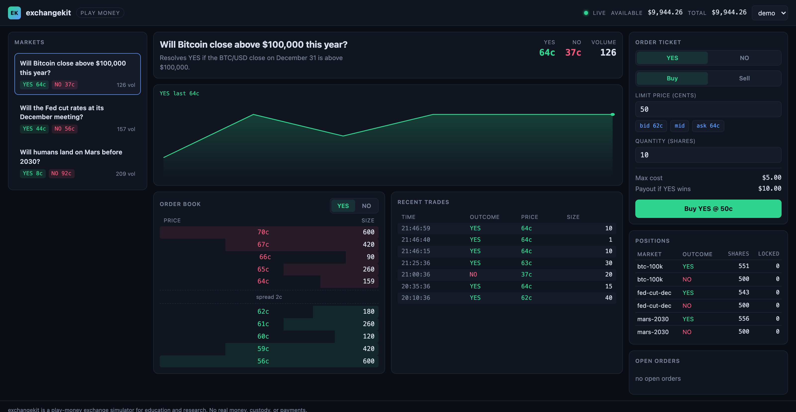
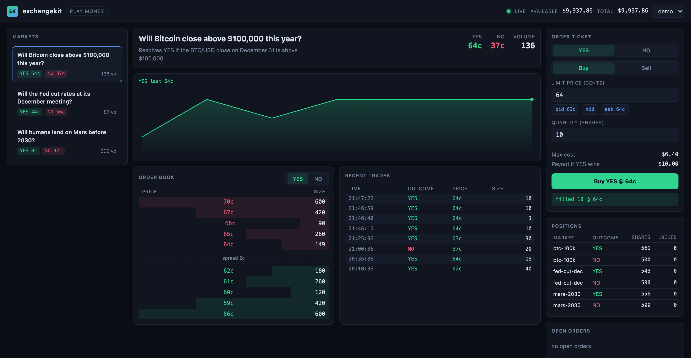
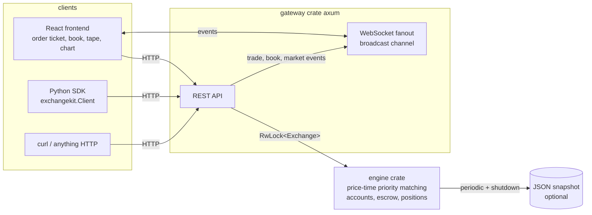

# exchangekit

A complete open-source exchange simulator you can run locally.

[](https://github.com/andreruizloera/exchangekit/actions/workflows/ci.yml)
[](LICENSE)
[](sdk/python)

exchangekit is a binary prediction-market exchange in miniature: a Rust
matching engine with strict price-time priority, a REST + WebSocket
gateway, a dark trading UI, and a typed Python SDK. One
`docker compose up` boots the whole thing with three seeded markets, a
market maker quoting both sides, and live trade history.

**Play money only.** exchangekit is a simulator for education and
research. It has no real-money custody, no payments, no brokerage, and
no authentication. Do not put real value behind it.



The order ticket works end to end: this buy crossed the book, printed on
the tape, and updated the position and balance, all over the live
WebSocket feed:



## Quickstart

```
git clone https://github.com/andreruizloera/exchangekit
cd exchangekit
docker compose up
```

Then open http://localhost:3000 for the trading UI. The gateway API is
on http://localhost:8080. Trade from Python:

```python
from exchangekit import Client   # pip install ./sdk/python

client = Client("http://localhost:8080")
market = client.market("btc-100k")
client.buy(market=market.id, outcome="YES", price=0.62, quantity=10)
```

## Example output

Real output of `./demo.sh` against a freshly seeded exchange:

```
== markets ==
btc-100k      YES 63c  NO 37c  vol  105  Will Bitcoin close above $100,000 this year?
fed-cut-dec   YES 44c  NO 56c  vol  157  Will the Fed cut rates at its December meeting?
mars-2030     YES  8c  NO 92c  vol  209  Will humans land on Mars before 2030?

== order book: btc-100k YES (top 3) ==
  ask 66c  x 90
  ask 65c  x 260
  ask 64c  x 180
  ----
  bid 62c  x 180
  bid 61c  x 260
  bid 60c  x 120

== demo buys 10 YES at the best ask ==
  order 79: filled, filled 10/10
  trade: 10 YES @ 64c (demo bought from marketmaker)

== demo account after the trade ==
  balance $9,951.30 (available $9,951.30)
  position: 540 YES shares in btc-100k
```

## Why?

Real exchanges are hard to study because the interesting part, the
matching engine, is proprietary and buried under compliance
infrastructure. exchangekit gives you the whole loop in a few thousand
readable lines: submit an order over HTTP, watch it cross a price-time
priority book, see the fill hit your balance, and stream the tape over a
WebSocket. That makes it useful for teaching market microstructure,
prototyping trading bots against a real (if small) limit order book, and
experimenting with exchange design without touching money.

## Installation

Requirements: Docker (easiest), or a recent stable Rust toolchain
(tested with 1.97), Node 20+, and Python 3.12+ to run the pieces
natively.

Docker (everything):

```
docker compose up
```

Native, piece by piece:

```
cargo run -p exchangekit-gateway          # gateway + engine on :8080
cd frontend && npm install && npm run dev # UI on :3000, proxies to :8080
pip install ./sdk/python                  # Python SDK
```

## Usage

Accounts are seeded at boot: `demo`, `alice`, and `bob` each start with
$10,000 in play money plus starter share inventory, and `marketmaker`
quotes both sides of every book. There is no authentication; requests
name their account.

Prices are integer cents from 1 to 99. A binary contract settles at 0 or
100 cents, so buying YES at 63c risks $0.63 to win $1.00 per share.
Orders are limit orders; a marketable limit order fills immediately at
resting prices and any remainder rests in the book. Sells require
shares, buys escrow cash at the limit price.

REST API:

| Method | Path | Purpose |
| --- | --- | --- |
| GET | /api/markets | list markets with price estimates and volume |
| GET | /api/markets/{id} | one market |
| GET | /api/markets/{id}/book?outcome=YES&depth=20 | aggregated bids and asks |
| GET | /api/markets/{id}/trades?limit=50 | recent trades, newest first |
| POST | /api/orders | place a limit order |
| GET | /api/orders/{id} | order status |
| DELETE | /api/orders/{id}?account=demo | cancel an open order |
| GET | /api/accounts/{id} | play-money balance |
| GET | /api/accounts/{id}/positions | share positions |
| GET | /api/accounts/{id}/orders | open orders |
| WS | /ws | hello snapshot, then trade, book, and market events |

Place an order with curl:

```
curl -X POST localhost:8080/api/orders -H 'content-type: application/json' \
  -d '{"account":"demo","market":"btc-100k","outcome":"YES","side":"BUY","price":64,"quantity":10}'
```

The Python SDK wraps all of it with typed methods: `markets`, `market`,
`book`, `trades`, `buy`, `sell`, `place_order`, `cancel`, `order`,
`open_orders`, `positions`, `balance`. See [sdk/python](sdk/python).

## Architecture



The engine is a synchronous, deterministic library with no I/O: one
`Exchange` struct holds markets, per-outcome order books
(`BTreeMap<price, FIFO queue>`), orders, accounts, and trade history.
The gateway wraps it in an `RwLock`, translates HTTP and WebSocket
traffic, and publishes every mutation to a broadcast channel that fans
out to all connected sockets. The frontend and SDK are plain API
clients; nothing bypasses the gateway.

State is in memory. Set `EXCHANGEKIT_SNAPSHOT=/path/state.json` (the
compose file does) and the gateway restores from a JSON snapshot at boot
and rewrites it every 30 seconds and on shutdown. There is no database
by design; see limitations.

## Testing

```
cargo test                        # 34 engine + seed tests
cd frontend && npm test           # frontend unit tests
cd sdk/python && .venv/bin/pytest # SDK unit tests; integration tests
                                  # run when a gateway is up, skip otherwise
```

Engine tests cover price priority, time priority within a level, partial
and full fills, marketable limits walking multiple levels, cancels and
escrow release, crossing and non-crossing orders, empty books, book
aggregation, cash and share conservation, and snapshot round-trips.

## Limitations

- YES and NO books are independent. There is no complementary matching
  (minting a YES + NO pair from two bids summing to 100c), so demo
  liquidity comes from a seeded market-maker account.
- Markets never resolve; contracts trade forever. Resolution and payout
  are on the roadmap.
- No authentication: any client can act as any account. This is a
  local simulator, not a service.
- Persistence is a JSON snapshot, not a database. A crash can lose up
  to 30 seconds of state.
- Selling requires owning shares; there is no shorting or collateral
  system yet.

See [ROADMAP.md](ROADMAP.md) for planned work.

## Contributing

See [CONTRIBUTING.md](CONTRIBUTING.md). The short version: keep the
engine deterministic, add a test for every matching behavior change, and
nothing that touches real money will be merged.

## License

MIT. See [LICENSE](LICENSE).

GitHub topics: exchange, prediction-markets, orderbook, matching-engine,
trading.
